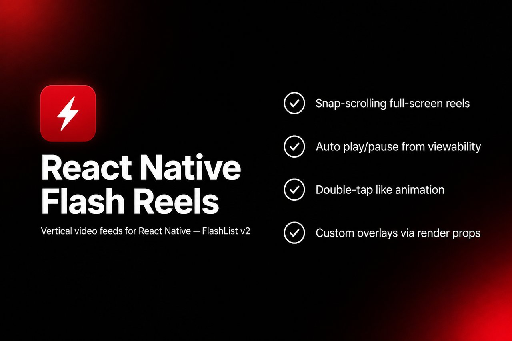
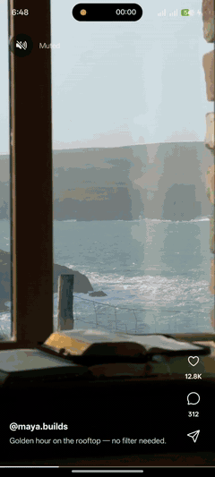
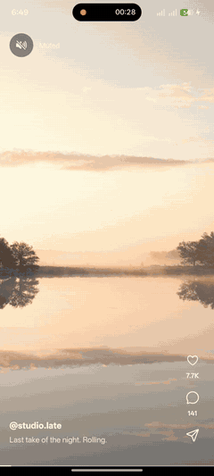

<p align="center">
  <div align="center">
    <a href="https://www.npmjs.com/package/react-native-flash-reels">
      
    </a>
    <a href="https://www.npmjs.com/package/react-native-flash-reels">
      
    </a>
    <a href="https://github.com/thedev204/react-native-flash-reels/blob/main/LICENSE">
      
    </a>
  </div>
  <div align="center">
    <a href="https://reactnative.dev/docs/the-new-architecture">
      
    </a>
    <a href="https://github.com/thedev204/react-native-flash-reels/issues">
      
    </a>
    <a href="https://semver.org/spec/v2.0.0.html">
      
    </a>
  </div>
</p>

<br/>

<h1 align="center">React Native Flash Reels</h1>

<p align="center">
  High-performance vertical video feed for React Native, built on FlashList v2.
</p>

<p align="center">
  
</p>

## Demo

<p align="center">
  
  
</p>

<p align="center">
  <a href="./assets/demo.mp4">Full demo video (MP4)</a>
</p>

---

## Requirements

| Package                        | Version   |
| :----------------------------- | :-------- |
| `@shopify/flash-list`          | >= 2.0.0  |
| `react-native-video`           | >= 6.0.0  |
| `react-native-reanimated`      | >= 4.0.0  |
| `react-native-worklets`        | >= 0.12.0 |
| `react-native-gesture-handler` | >= 2.0.0  |

Requires the React Native New Architecture.

## Installation

```sh
npm install react-native-flash-reels @shopify/flash-list react-native-video react-native-reanimated react-native-worklets react-native-gesture-handler
```

```sh
yarn add react-native-flash-reels @shopify/flash-list react-native-video react-native-reanimated react-native-worklets react-native-gesture-handler
```

See the [installation guide](https://thedev204.github.io/react-native-flash-reels/docs/installation) for Babel / gesture-handler setup.

## Quick Start

```tsx
import {
  FlashReels,
  useFlashReels,
  MuteButton,
} from 'react-native-flash-reels';
import type { ReelData } from 'react-native-flash-reels';

type Reel = ReelData & { username: string; caption: string };

const data: Reel[] = [
  {
    id: '1',
    videoUri: 'https://example.com/one.mp4',
    posterUri: 'https://example.com/one.jpg',
    duration: 12.5,
    username: 'maya',
    caption: 'Golden hour',
  },
];

function Overlay({ item }: { item: Reel }) {
  const { isMuted } = useFlashReels();
  return (
    <>
      <MuteButton />
      <Text>@{item.username}</Text>
      <Text>{item.caption}</Text>
      <Text>{isMuted ? 'Muted' : 'Sound on'}</Text>
    </>
  );
}

export function ReelsScreen() {
  return (
    <FlashReels
      data={data}
      defaultMuted
      showProgressBar
      onLike={(item) => console.log('liked', item.id)}
      renderOverlay={(item) => <Overlay item={item} />}
    />
  );
}
```

## Documentation

Full API reference, guides, and examples are available on the **[official documentation website](https://thedev204.github.io/react-native-flash-reels/)**.

- [Getting Started](https://thedev204.github.io/react-native-flash-reels/docs/intro)
- [Installation](https://thedev204.github.io/react-native-flash-reels/docs/installation)
- [Usage](https://thedev204.github.io/react-native-flash-reels/docs/usage)
- [Props API](https://thedev204.github.io/react-native-flash-reels/docs/api/props)
- [Hooks](https://thedev204.github.io/react-native-flash-reels/docs/api/hooks)
- [Performance](https://thedev204.github.io/react-native-flash-reels/docs/performance)

## Changelog

See [CHANGELOG.md](./CHANGELOG.md) for release history.

## Contributing

Contributions are welcome! Please read [CONTRIBUTING.md](./CONTRIBUTING.md) before submitting a pull request.

- Report bugs in the [Issue Tracker](https://github.com/thedev204/react-native-flash-reels/issues).
- Report security issues via [SECURITY.md](./SECURITY.md).

## License

MIT
